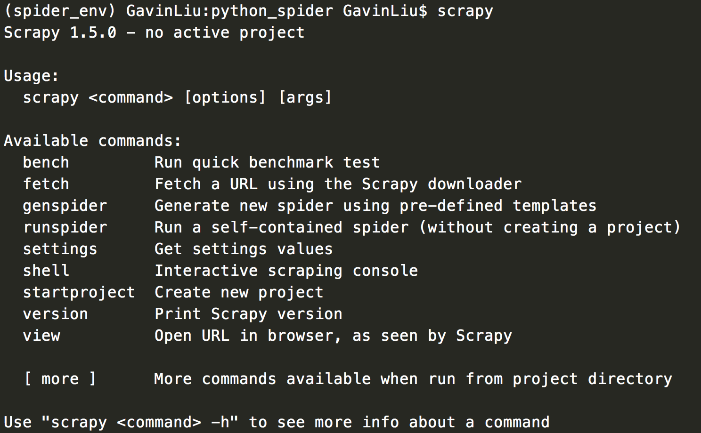
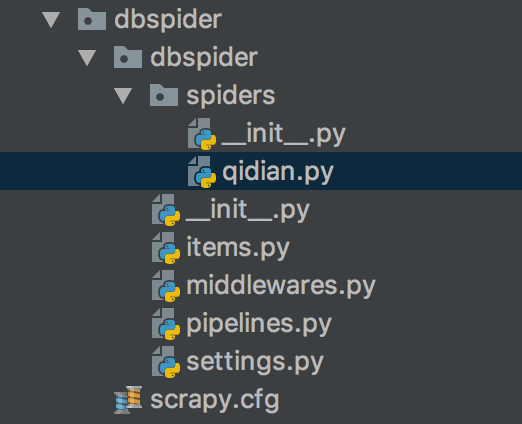
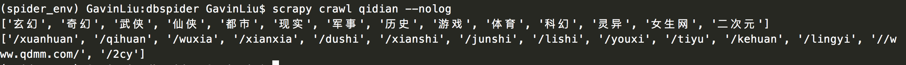

### 1. 安装

```python
$ pip install Scrapy
```

查看是否安装成功, 如出现下图则安装成功




### 2. Scrapy组件

#### 1. 引擎(Scrapy)

用来处理整个系统的数据流处理, 触发事务(框架核心)

#### 2. 调度器(Scheduler)

用来接受引擎发过来的请求, 压入队列中, 并在引擎再次请求的时候返回. 可以想像成一个URL（抓取网页的网址或者说是链接）的优先队列, 
由它来决定下一个要抓取的网址是什么, 同时去除重复的网址

#### 3. 下载器(Downloader)

用于下载网页内容, 并将网页内容返回给蜘蛛(Scrapy下载器是建立在twisted这个高效的异步模型上的)

#### 4. 爬虫(Spiders)

爬虫是主要干活的, 用于从特定的网页中提取自己需要的信息, 即所谓的实体(Item)。用户也可以从中提取出链接,让Scrapy继续抓取下一个页面

#### 5. 项目管道(Pipeline)

负责处理爬虫从网页中抽取的实体，主要的功能是持久化实体、验证实体的有效性、清除不需要的信息。当页面被爬虫解析后，
将被发送到项目管道，并经过几个特定的次序处理数据。

#### 6. 下载器中间件(Downloader Middlewares)

位于Scrapy引擎和下载器之间的框架，主要是处理Scrapy引擎与下载器之间的请求及响应。

#### 7. 爬虫中间件(Spider Middlewares)

介于Scrapy引擎和爬虫之间的框架，主要工作是处理蜘蛛的响应输入和请求输出。

#### 8. 调度中间件(Scheduler Middewares)

介于Scrapy引擎和调度之间的中间件，从Scrapy引擎发送到调度的请求和响应。


### 3. 处理流程

Scrapy的整个数据处理流程由Scrapy引擎进行控制，通常的运转流程包括以下的步骤：

1. 引擎询问蜘蛛需要处理哪个网站，并让蜘蛛将第一个需要处理的URL交给它。
2. 引擎让调度器将需要处理的URL放在队列中。
3. 引擎从调度那获取接下来进行爬取的页面。
4. 调度将下一个爬取的URL返回给引擎，引擎将它通过下载中间件发送到下载器。
5. 当网页被下载器下载完成以后，响应内容通过下载中间件被发送到引擎；如果下载失败了，引擎会通知调度器记录这个URL，待会再重新下载。
6. 引擎收到下载器的响应并将它通过蜘蛛中间件发送到蜘蛛进行处理。
7. 蜘蛛处理响应并返回爬取到的数据条目，此外还要将需要跟进的新的URL发送给引擎。
8. 引擎将抓取到的数据条目送入条目管道，把新的URL发送给调度器放入队列中。

上述操作中的2-8步会一直重复直到调度器中没有需要请求的URL，爬虫停止工作。

### 4. Scrapy项目

#### 4.1 创建项目

```python
$ scrapy startproject dbspider
```

#### 4.2 文件解释

文件说明：

**scrapy.cfg**:项目的配置信息，主要为Scrapy命令行工具提供一个基础的配置信息。（真正爬虫相关的配置信息在settings.py文件中）

**items.py**:设置数据存储模板，用于结构化数据，如：Django的Model

**pipelines**:数据处理行为，如：一般结构化的数据持久化

**settings.py**:配置文件，如：递归的层数、并发数，延迟下载等

**spiders**:爬虫目录，如：创建文件，编写爬虫规则。

在spiders文件中创建爬虫的时候，一般以爬取的网站的域名为爬虫的名称

### 5. 编写爬虫

#### 5.1 创建爬虫文件

```python
$ cd dbspider
$ scrapy genspider qidian qidian.com
# 第一个参数-名称 第二个参数-域名
```

结果如下:



####5.2 案列 

爬取起点中文网的网页源码,爬取小说分类名称以及url

```python
# -*- coding: utf-8 -*-
import scrapy
from scrapy import Selector


class QidianSpider(scrapy.Spider):
    name = 'qidian'
    allowed_domains = ['qidian.com']
    start_urls = ['http://qidian.com/']

    # 回调函数
    def parse(self, response):
        # 爬取时请求的url
        current_url = response.url

        # 返回的html
        body = response.body

        # 返回的html unicode编码
        unicode_body = response.body_as_unicode()
        res = Selector(response)

        # 获取小说的分类信息
        xiaoshuo_type = res.xpath('//*[@id="classify-list"]/dl/dd/a/cite/span/i/text()').extract()
        xiaoshuo_href = res.xpath('//*[@id="classify-list"]/dl/dd/a/@href').extract()

        print(xiaoshuo_type)
        print(xiaoshuo_href)

```

启动项目: 

方式一

```python
$ scrapy crawl qidian [--nolog]
# nolog 不打印日志
```

方式二

创建一个 main.py

```
from scrapy.cmdline import execute
execute(['scrapy', 'crawl', 'qidian'])
```

```python
$ python main.py
```

结果如下: 




### 6. 设置代理

middlewares.py 

```python
import random

import requests
from scrapy.downloadermiddlewares.useragent import UserAgentMiddleware

from weibospider import settings


class RandomUserAgent(UserAgentMiddleware):
    """
    设置user-Agent方法
    """

    def process_request(self, request, spider):
        user_agent = random.choice(settings.agents)
        request.headers.setdefault(b'User-Agent', user_agent)


class RandomProxy(object):
    """
    设置代理IP
    """

    def process_request(self, request, spider):
        proxy = requests.get('http://10.7.152.151:5555/random').text
        uri = 'https://{proxy}'.format(proxy=proxy)
        request.meta['proxy'] = uri

```

 setting.py

注释默认的中间件, 启用自己调用的中间件

```python
DOWNLOADER_MIDDLEWARES = {
   'weibospider.middlewares.RandomUserAgent': 543,
   'weibospider.middlewares.RandomProxy': 544,
}
```

