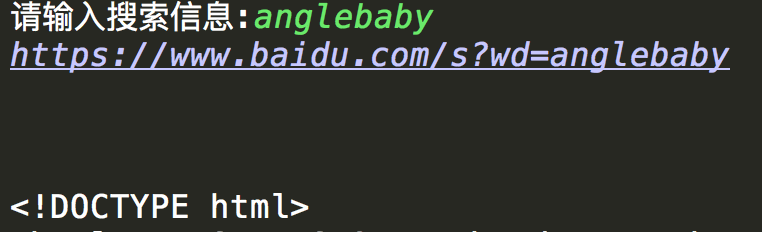
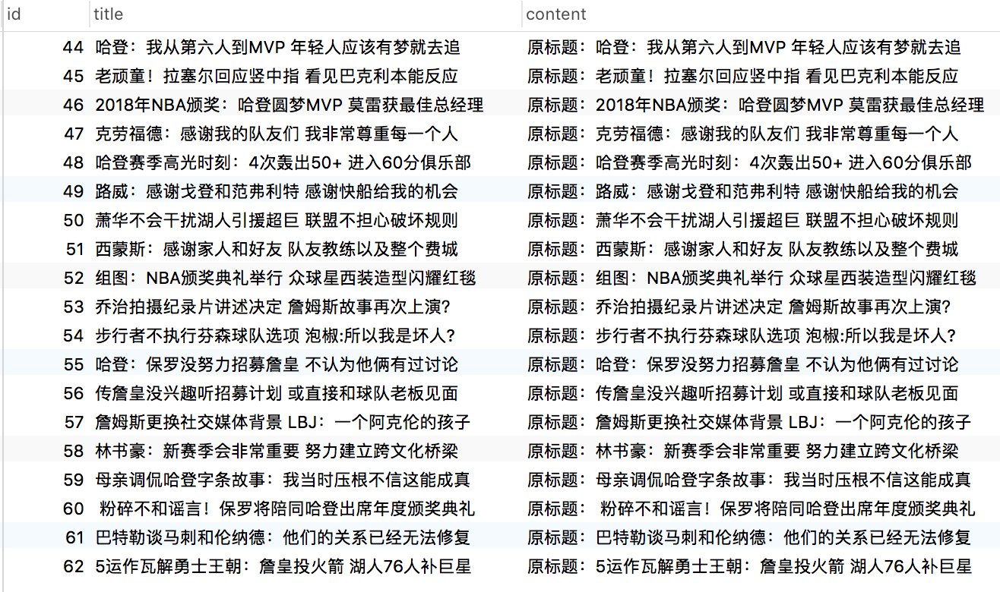
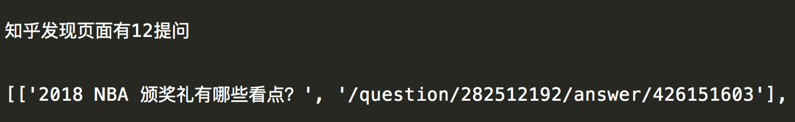

### 1. urllib

#### 1.1 使用urllib进行编码和解码

```python
from urllib import parse

# 编码
enstr = parse.urlencode({'kd': '哈哈'})
# 打印的结果为 kd=%E5%8D%83%E5%B3%B0
print(enstr)

# 解码
destr = parse.unquote(enstr)
# 解码的结果为 kd=哈哈
print(destr)
```

#### 1.2 简单案列--百度搜索

```python
import random
import ssl
import urllib.request
from urllib import parse

def main(url):
    header = {
        # 请求头
        'User-Agent': 'Mozilla/5.0 (Windows NT 6.1; WOW64) AppleWebKit/537.36 (KHTML, like Gecko) Chrome/65.0.3325.181 Safari/537.36'
,
    }
    # 关闭证书验证
    context = ssl._create_unverified_context()
    req = urllib.request.Request(url, headers=header)
    res = urllib.request.urlopen(req, context=context)
    return res.read().decode('utf-8')


if __name__ == '__main__':
    msg = input('请输入搜索信息:')
    search = parse.urlencode({'wd': msg})
    url = 'https://www.baidu.com/s?%s' % search
    result = main(url)

```

运行结果:



### 2. XPATH

#### 2.1 Xpath基本用法

```python
# lxml 需要使用 pip install lxml安装后才能导入
from lxml import etree

html = '''
	<!DOCTYPE html>
	<html lang="en">
	<head>
	    <meta charset="UTF-8">
	    <title>Title</title>
	</head>
	<body>
	    <div>
	        <ul>
	            <li class="class1"><a href="class1.html">1</a></li>
	            <li class="class2"><a href="class2.html">2</a></li>
	            <li class="class3"><a href="class3.html">3</a></li>
	            <li class="class4"><a href="class4.html">4</a></li>
	            <li class="class5"><a href="class5.html">5</a></li>
	            <li>
	                <ul class="class1">
	                    <li class="class1"><a href="class6.html">6</a></li>
	                    <li class="class7"><a href="class7.html">7</a></li>
	                    <li class="class8"><a href="class8.html">8</a></li>
	                </ul>
	            </li>
	        </ul>
	    <div>
	</body>
	</html>
'''

# 解析html结构
html = etree.HTML(html)

# 获取根节点
a = html.xpath('/html/body')
# 获取body
a = html.xpath('/html/body')
print(a)

# 获取当前节点
a1 = html.xpath('//ul')
print(a1)

# 获取当前节点
for i in a1:
    print(i.xpath('.'))

# 获取当前节点下一个节点
a2 = a1[0]
print(a2.xpath('./li[1]'))

# 获取当前第一个节点的父节点
a2 = a1[0]
a3 = a2.xpath('..')
print(a3)

# 选择属性,获取ul下的li的类定义为class1的信息
a4 = html.xpath('//ul/li[@class="class1"]')
print(a4)

# 获取全局的div下的全局的ul
a5 = html.xpath('//div//ul')
print(a5)

# 获取任意节点下的class为class1的元素
a6 = html.xpath('//*[@class="class1"]')
print(a6)

# 获取ul节点下的第一个元素
a7 = html.xpath('//ul/li[1]')
print(a7)

# 获取div下第一个ul元素
a8 = html.xpath('//div/ul[1]')
print(a8)

# 获取ul标签下的li标签中a的值
a9 = html.xpath('//ul/li/a')
for a in a9:
    print(a.xpath('./text()'))


# 获取li标签下a的href属性
for li in a9:
    print(li.xpath('./@href'))

```

#### 2.2 简单案列

使用正则/Xpath获取搜狐体育新闻标题及内容, 并存储至数据库

```python
pip install pymysql
pip install lxml
```

```python
import re
import random
import ssl
import urllib.request

import pymysql as pymysql
from lxml import etree


def decode_html(html, charsets=('UTF-8','GBK')):
    """
    解码页面
    """
    page_html = ''
    for charset in charsets:
        try:
            page_html = html.decode(charset)
            break
        except Exception as e:
            pass
            # print('编码错误')
    return page_html


def get_html_response(url):
    """
    获取页面响应信息
    """
    headers = {
        'User-Agent': 'Mozilla/5.0 (Windows NT 6.1; WOW64) AppleWebKit/537.36 (KHTML, like Gecko) Chrome/65.0.3325.181 Safari/537.36',
    }
    context = ssl._create_unverified_context()
    request = urllib.request.Request(url, headers=headers)
    response = urllib.request.urlopen(request, context=context)
    return decode_html(response.read())
    
def pattern_regex(html, parrent, flags=re.S):
    """
    定义正则配方法
    :param html: 请求的页面
    :param parrent: 正则表达式
    :param flags: 标志
    :return: 匹配结果(列表形式)
    """
    parrent = re.compile(parrent, flags)
    result = re.findall(parrent, html)
    return result


def get_mysql(sql, params_list):
	"""
	连接数据库
	:param sql: sql插入语句
	:param params_list: 存储至数据库的字段的值
	"""
    # 数据库连接
    conn = pymysql.Connect(host='localhost', port=3306, user='root',
                           password='root', database='spider', charset='utf8')
    # 创建游标
    with conn.cursor() as cursor:
        # 将数据保存到数据库
        cursor.executemany(sql, params_list)
        # 提交事务
        conn.commit()


def start_crawl(url):
    """
    使用正则获取网页信息
    :param url: 请求网页的网址
    """
    # 获取首页页面
    html = get_html_response(url)
    # 获取首页标题链接
    link_list = pattern_regex(html, "<a test=a href='(.*?)' target='_blank'>.*?")

    params_list = []
    for link_url in link_list:
        # 获取详情页页面
        html = get_html_response(link_url)
        # 获取详情页标题
        title = pattern_regex(html, '<h1>(.*?)<span.*?</h1>')
        # 获取详情页内容
        content = pattern_regex(html, '<article class="article" id="mp-editor">(.*?)</article>')
        if title:
            # 将标题和内容存入列表中
            params_list.append([title[0], content[0]])
    sql = 'insert into sohu(title,content) values(%s, %s) '
    get_mysql(sql, params_list)


def start_crawl_xpath(url):
    """
    使用Xpath获取网页信息
    :param url: 请求网页的链接
    """
    html = etree.HTML(get_html_response(url))
    # 获取标题列表
    li_list = html.xpath('/html/body/div[1]/div[4]/div[1]/div[1]/ul/li')
    params_list = []
    for li in li_list:
        # 获取每个li标签下的a标签的href属性值
        a_link = li.xpath('./a/@href')
        if a_link:
            # 获取详情页面
            content_html = etree.HTML(get_html_response(a_link[0]))
            title = content_html.xpath('//*[@id="article-container"]/div[2]/div[1]/div[1]/h1/text()')
            content = content_html.xpath('//*[@id="mp-editor"]/p/text()')
            if title:
                params_list.append([title[0], content[0]])
    sql = 'insert into sohu(title,content) values(%s, %s) '
    get_mysql(sql, params_list)


if __name__ == '__main__':
    url = 'http://sports.sohu.com/nba_a.shtml'
    # start_crawl(url)
    start_crawl_xpath(url)

```

运行结果:



### 3. BeautifulSoup

####3.1 爬取知乎问题页面

```python
pip install bs4
```

```python
import random

import requests
from bs4 import BeautifulSoup


def start_crawl(url):
    headers = {
        'User-Agent': random.choice(user_agents.agents),
    }
    request = requests.get(url, headers=headers)
    # 使用bs4解析页面
    soup = BeautifulSoup(request.text, 'lxml')
    result = soup.find_all('a', 'question_link')
    # print(result)
    question_list = []
    for i in result:
        question_list.append([i.text.replace('\n', ''), i.attrs['href']])
    print('知乎发现页面有%s提问' % len(result))
    print(question_list)


if __name__ == '__main__':
    url = 'https://www.zhihu.com/explore'
    start_crawl(url)

```

运行结果:



#### 3.2 获取豆瓣电影评分

```python
import random
from urllib import parse

import requests

import user_agents

def get_response(url):
    """
    第一步
    :param url: 查询的链接
    获取网页响应信息
    """
    headers = {
        'User-Agent': 'Mozilla/5.0 (Windows NT 6.1; WOW64) AppleWebKit/537.36 (KHTML, like Gecko) Chrome/65.0.3325.181 Safari/537.36',
        'Referer': 'https://movie.douban.com/'
    }
    resp = requests.get(url, headers=headers)
    # resp.json() 返回ajax加载的json数据
    return resp.json()


def get_tags(url):
    """
    第二步
    获取电影分类标签
    """
    resp = get_response(url)
    tags = resp['tags']
    return tags


def get_result(url, tag):
    """
    第三步
    通过分类标签获取分类下的电影名称及评分
    :param url: 请求的链接
    :param tag: 分类标签
    """
    resp = get_response(url)
    result_list = resp['subjects']
    results = ''
    for result in result_list:
        results += '%s电影: %s  评分:%s \n' % (tag, result['title'], result['rate'])
    return results


def save_result(result):
    """
    第四步
    保存信息
    :param result: 查询结果
    """
    with open('电影.txt', 'a', encoding='utf-8') as f:
        f.write(result + '\n\n')


def main():
    # 分类标签链接
    tag_url = 'https://movie.douban.com/j/search_tags?type=movie&tag=%E7%83%AD%E9%97%A8&source='
    tags = get_tags(tag_url)
    for tag in tags:
        # 通过标签组装查询的链接
        search = parse.urlencode({'tag': tag})
        result_url = 'https://movie.douban.com/j/search_subjects?type=movie&%s&sort=recommend&page_limit=20&page_start=0' % search
        results = get_result(result_url, tag)
        save_result(results)


if __name__ == '__main__':
    main()

```

运行结果:

[电影及评分.txt](../bs4_douban_movies/movie.txt)
